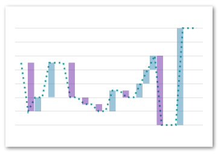

# react-native-svg-charts

[](https://www.npmjs.com/package/react-native-svg-charts)
[](https://www.npmjs.com/package/react-native-svg-charts)

## Prerequisites

This library uses [react-native-svg](https://github.com/react-native-community/react-native-svg) to render its graphs. Therefore this library is listed as a `peerDependency` and needs to be installed **AND** linked into your project to work.

## Motivation

Creating beautiful graphs in React Native shouldn't be hard or require a ton of knowledge.
With react-native-svg-charts we utilize the very popular [d3](https://d3js.org/) library to create our SVG paths and to calculate all coordinates.

## Components

This library currently provides the following chart components
* [Area](#areachart)
* [Bar](#barchart)
* [Line](#linechart)
* [Pie](#piechart)
* [Progress- Circle / Gauge](#progresschart)
* [Waterfall](#waterfallchart)

### AreaChart

#### Example

```javascript
import { AreaChart } from 'react-native-svg-charts'

const chart = () => (
    <AreaChart
        style={styles.flex1}
        dataPoints={data.map(data => data.value)}
        showPoints={false}
        strokeColor={'white'}
        strokeWidth={2}
        renderGradient={({ id }) => (
            <LinearGradient id={id} x1={'0'} y={'0'} x2={'0'} y2={`50%`}>
                <Stop offset={'0'} stopColor={'blue'} stopOpacity={0.9}/>
                <Stop offset={`1`} stopColor={'blue'} stopOpacity={0.3}/>
            </LinearGradient>
        )}
        contentInset={{ bottom: 10, left: 15, top: 10, right: 15 }}
    />
)
```

#### Props


| Property | Default | Description |
| --- | --- | --- |
| dataPoints | **required** | An array of integers - the data points you want plotted |
| strokeColor | 'black' | PropTypes.string |
| strokeWidth | 1 | PropTypes.number |
| fillColor | 'none' | PropTypes.string |
| dashArray | [ 5, 5] | PropTypes.arrayOf(PropTypes.number) |
| showPoints | true |  PropTypes.bool |
| pointColor | 'white' | PropTypes.string |
| renderGradient | `() => {}` | PropTypes.func (see [this](https://github.com/react-native-community/react-native-svg#lineargradient) for more info) |
| pointSize | 5 | PropTypes.number |
| pointWidth | 5 | PropTypes.number |
| animate | true | PropTypes.bool |
| animationDuration | 300 | PropTypes.number |
| style | undefined | PropTypes.any |
| curve | foo | PropTypes.func |
| contentInset | `{ top: 0, left: 0, right: 0, bottom: 0 }` | PropTypes.shape |
| numberOfTicks | 9 | PropTypes.number |
| showGrid | true | PropTypes.bool |
| gridMin | undefined | PropTypes.number |
| gridMax | undefined | PropTypes.number |
| intersections | [ ] | PropTypes.arrayOf(PropTypes.number) |
| renderIntersection | `() => {}` | PropTypes.func |

### BarChart


| Property | Default | Description |
| --- | --- | --- |
| dataPoints | **required** | dataPoints: PropTypes.arrayOf(PropTypes.shape({ <br> fillColor: PropTypes.string, <br> strokeColor: PropTypes.string, <br> strokeColorNegative: PropTypes.string, <br>fillColorNegative: PropTypes.string, <br>values: PropTypes.arrayOf(PropTypes.number).isRequired, <br>})).isRequired, |
| spacing | 0.05 | PropTypes.number |
| strokeColor | 'black' | PropTypes.string |
| strokeWidth | 1 | PropTypes.number |
| fillColor | 'none' | PropTypes.string |
| renderGradient | `() => {}` | PropTypes.func (see [this](https://github.com/react-native-community/react-native-svg#lineargradient) for more info) |
| animate | true | PropTypes.bool |
| animationDuration | 300 | PropTypes.number |
| style | undefined | PropTypes.any |
| curve | foo | PropTypes.func |
| contentInset | `{ top: 0, left: 0, right: 0, bottom: 0 }` | PropTypes.shape |
| numberOfTicks | 9 | PropTypes.number |
| showGrid | true | PropTypes.bool |
| gridMin | undefined | PropTypes.number |
| gridMax | undefined | PropTypes.number |
| intersections | [ ] | PropTypes.arrayOf(PropTypes.number) |
| renderIntersection | `() => {}` | PropTypes.func |

### LineChart


| Property | Default | Description |
| --- | --- | --- |
| dataPoints | **required** | An array of integers - the data points you want plotted |
| strokeColor | 'black' | PropTypes.string |
| strokeWidth | 1 | PropTypes.number |
| shadowColor | 'black' | PropTypes.string |
| fillColor | 'none' | PropTypes.string |
| dashArray | [ 5, 5] | PropTypes.arrayOf(PropTypes.number) |
| showPoints | true |  PropTypes.bool |
| pointColor | 'white' | PropTypes.string |
| pointSize | 5 | PropTypes.number |
| pointWidth | 5 | PropTypes.number |
| animate | true | PropTypes.bool |
| animationDuration | 300 | PropTypes.number |
| style | undefined | PropTypes.any |
| curve | foo | PropTypes.func |
| contentInset | `{ top: 0, left: 0, right: 0, bottom: 0 }` | PropTypes.shape |
| numberOfTicks | 9 | PropTypes.number |
| showGrid | true | PropTypes.bool |
| gridMin | undefined | PropTypes.number |
| gridMax | undefined | PropTypes.number |
| intersections | [ ] | PropTypes.arrayOf(PropTypes.number) |
| renderIntersection | `() => {}` | PropTypes.func |


### PieChart


| Property | Default | Description |
| --- | --- | --- |
| dataPoints | **required** | PropTypes.arrayOf(PropTypes.shape({ color: PropTypes.string.isRequired, key: PropTypes.string.isRequired, value: PropTypes.number.isRequired, })).isRequired |
| innerRadius | 0.5 | PropTypes.number |
| padAngle | |  PropTypes.number |
| animate | true |  PropTypes.bool |
| animationDuration | 300 | PropTypes.number |
| style | | PropTypes.any |
| renderLabel | `() => {}` | PropTypes.func |
| labelSpacing | 0 | PropTypes.number |

### ProgressGauge


| Property | Default | Description |
| --- | --- | --- |
| progress | **required** | PropTypes.number.isRequired |
| style | | PropTypes.any |
| progressColor | 'black' | PropTypes.any |
| startAngle | `-Math.PI * 0.8` | PropTypes.number |
| endAngle | `Math.PI * 0.8` |  PropTypes.number |
| animate | true | PropTypes.bool |
| animateDuration | 300 | PropTypes.number |

### WaterfallChart


| Property | Default | Description |
| --- | --- | --- |
| dataPoints | **required** | dataPoints: PropTypes.arrayOf(PropTypes.shape({ <br> fillColor: PropTypes.string, <br> strokeColor: PropTypes.string, <br> strokeColorNegative: PropTypes.string, <br>fillColorNegative: PropTypes.string, <br>values: PropTypes.arrayOf(PropTypes.number).isRequired, <br>})).isRequired, |
| spacing | 0.05 | PropTypes.number |
| strokeColor | 'black' | PropTypes.string |
| strokeWidth | 1 | PropTypes.number |
| fillColor | 'none' | PropTypes.string |
| renderGradient | `() => {}` | PropTypes.func (see [this](https://github.com/react-native-community/react-native-svg#lineargradient) for more info) |
| animate | true | PropTypes.bool |
| animationDuration | 300 | PropTypes.number |
| style | undefined | PropTypes.any |
| curve | foo | PropTypes.func |
| contentInset | `{ top: 0, left: 0, right: 0, bottom: 0 }` | PropTypes.shape |
| numberOfTicks | 9 | PropTypes.number |
| showGrid | true | PropTypes.bool |
| gridMin | undefined | PropTypes.number |
| gridMax | undefined | PropTypes.number |
| intersections | [ ] | PropTypes.arrayOf(PropTypes.number) |
| renderIntersection | `() => {}` | PropTypes.func |
