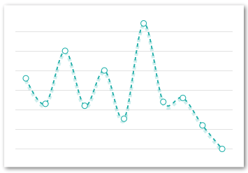
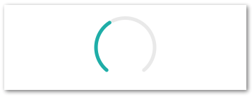

# react-native-svg-charts

[](https://www.npmjs.com/package/react-native-svg-charts)
[](https://www.npmjs.com/package/react-native-svg-charts)
[](https://www.npmjs.com/package/react-native-svg-charts)

## Prerequisites

This library uses [react-native-svg](https://github.com/react-native-community/react-native-svg)
to render its graphs. Therefore this library needs to be installed **AND** linked into your project to work.

## Motivation

Creating beautiful graphs in React Native shouldn't be hard or require a ton of knowledge.
We use [react-native-svg](https://github.com/react-native-community/react-native-svg) in order to render our SVG's and to provide you with great extensibility.
We utilize the very popular [d3](https://d3js.org/) library to create our SVG paths and to calculate the coordinates.

We built this library to be as extensible as possible while still providing you with the most common charts and data visualization tools out of the box.
The Line-, Bar-, Area- and Waterfall -charts can all be extended with "accessories" and "extras".
The `renderDecorator` prop is called on each passed `dataPoint` and allow you to simply add things such as points or other decorators to your charts.
The `extras` and `renderExtra` prop is used to further decorate your charts with e.g intersections and projections, see the examples for more info.

## Common Props

| Property | Default | Description |
| --- | --- | --- |
| dataPoints | **required** | An array of integers - the data you want plotted, e.g \[1,2,3,4]. This prop is different for [PieChart](#piechart) and [BarChart](#barchart) |
| strokeColor | 'black' | color of the stroke|
| strokeWidth | 1 | width of the stroke |
| fillColor | 'none' | color of the fill |
| dashArray | \[ 5, 5 ] | see [this](https://developer.mozilla.org/en-US/docs/Web/SVG/Attribute/stroke-dasharray) but pass in as array  |
| renderGradient | `() => {}` | function that renders the gradient. [Example](#gradient) |
| animate | true | PropTypes.bool |
| animationDuration | 300 | PropTypes.number |
| style | undefined | Supports all [ViewStyleProps](https://facebook.github.io/react-native/docs/viewstyleproptypes.html) |
| curve | d3.curveCardinal | A function like [this](https://github.com/d3/d3-shape#curves) |
| contentInset | { top: 0, left: 0, right: 0, bottom: 0 } | An object that specifies how much fake "margin" to use inside of the SVG canvas. This is particularly helpful on Android where `overflow: "visible"` isn't supported and might cause clipping. Note: important to have same contentInset on axis's and chart |
| numberOfTicks | 10 | We use [d3-array](https://github.com/d3/d3-array#ticks) to evenly distribute the grid and dataPoints on the yAxis. This prop specifies how many "ticks" we should try to render. Note: important that this prop is the same on both the chart and on the yAxis |
| showGrid | true | Whether or not to show the grid lines |
| gridMin | undefined | Normally the graph tries to draw from edge to edge within the view bounds. Using this prop will allow the grid to reach further than the actual dataPoints. [Example](#gridmin/max) |
| gridMax | undefined | The same as "gridMin" but will instead increase the grids maximum value |

## Components

This library currently provides the following components
* [YAxis](#yaxis)
* [XAxis](#xaxis)
* [Area](#areachart)
* [Bar](#barchart)
* [Line](#linechart)
* [Pie](#piechart)
* [Progress- Circle / Gauge](#progresschart)
* [Waterfall](#waterfallchart)
* Decorators (Preferably build your own but you can use these for inspiration)
    * [Point](#point)
    * [HorizontalLine](#horizontalline)
    * [Tooltip](#tooltip)

### YAxis


A helper component to layout your Y-axis labels on the same coordinates as your chart.
It's very important that the component has the exact same view bounds (preferably wrapped in the same parent view) as the chart it's supposed to match.
If the chart has property `contentInset` set it's very important that the YAxis has the same vertical contentInset.
#### Example
See [example](#chart-with-axis)
#### Props

(see [Common Props](#common-props))

| Property | Default | Description |
| --- | --- | --- |
| labelStyle | undefined | Supports all [TextStyleProps](https://facebook.github.io/react-native/docs/textstyleproptypes.html) |
| formatLabel | `value => {}` | A utility function to format the text before it is displayed, e.g `value => "$" + value |
| contentInset | { top: 0, bottom: 0 } | Used to sync layout with chart (if same prop used there) |

### XAxis


A helper component to layout your X-axis labels on the same coordinates as your chart.
It's very important that the component has the exact same view bounds (preferably wrapped in the same parent view) as the chart it's supposed to match.
If the chart has property `contentInset` set it's very important that the YAxis has the same horizontal contentInset.
The XAxis has a special property `chartType` that should match the type of the chart in order to layout the labels correctly

### Example
See [example](#chart-with-axis)

#### Props

| Property | Default | Description |
| --- | --- | --- |
| values | **required** | An array of values to render on the xAxis. Should preferably have the same length as the chart's dataPoints. |
| chartType | `XAxis.Type.LINE`| Should state what chart type it is rendered next to. Important because of slightly different calculations. One of \[ XAxis.Type.LINE, XAxis.Type.BAR ] |
| spacing | 0.05 | Only applicable if `chartType=XAxis.Type.BAR` and should then be equal to `spacing` prop on the actual BarChart.   |
| labelStyle | undefined | Supports all [TextStyleProps](https://facebook.github.io/react-native/docs/textstyleproptypes.html) |
| formatLabel | `value => {}` | A utility function to format the text before it is displayed, e.g `value => "day" + value |
| contentInset | { left: 0, right: 0 } | Used to sync layout with chart (if same prop used there) |

### AreaChart


#### Example

```javascript
import { AreaChart } from 'react-native-svg-charts'

const chart = () => (
    <AreaChart
        style={{ height: 200 }}
        dataPoints={data.map(data => data.value)}
        showPoints={false}
        strokeColor={'white'}
        strokeWidth={2}
        contentInset={{ bottom: 10, left: 15, top: 10, right: 15 }}
    />
)
```

#### Props

See [Common Props](#common-props)

### BarChart


#### Example
```javascript
import { BarChart } from 'react-native-svg-charts'

const foo = () => (
    <BarChart
        style={{ height: 200 }}
        dataPoints={[
            {
                ...colors,
                values: [5,3,2,3]
            },
            {
                ...colors,
                values: [-5,2,5,-3]
            }
        ]}
        spacing={0.3}
    />
)
```

### Props
Also see [Common Props](#common-props)

| Property | Default | Description |
| --- | --- | --- |
| dataPoints | **required** | Slightly different than other charts since we allow for grouping of bars. This array should contain at least one object with the following shape `{fillColor: 'string', fillColorNegative: 'string', strokeColorPositive: 'string', strokeColorNegative: '', values: []}` |
| spacing | 0.05 | Spacing between the bars (or groups of bars). Percentage of one bars width. Default = 5% of bar width |
| contentInset | `{ top: 0, left: 0, right: 0, bottom: 0 }` | PropTypes.shape |

### LineChart


#### Example

```javascript
import { LineChart } from 'react-native-svg-charts'

const foo = () => (
    <LineChart
        style={{ height: 200 }}
        dataPoints={data}
        dashArray={[ 5, 5 ]}
        shadowColor={'rgba(34, 182, 176, 0.2)'}
        contentInset={{ bottom: 10, left: 15, right: 15, top: 10 }}
    />
)
```

#### Props
See [Common Props](#common-props)


### PieChart


#### Example
```javascript
import { PieChart } from 'react-native-svg-charts'

const foo = () => (
    <PieChart
        style={{height: 200}
        dataPoints={[
            {
                key: 'foo',
                color: 'blue',
                value: 40,
            },
            {
                key: 'bar',
                color: 'green',
                value: 60,
            },
        ]}
        innerRadius={0.7}
        labelSpacing={40}
        renderLabel={item => (
            <TouchableOpacity onPress={() => console.log('clicked!', item)}>
                <Image source={Label}/>
            </TouchableOpacity>
        )}
    />
)
```

#### Props

| Property | Default | Description |
| --- | --- | --- |
| dataPoints | **required** | Slightly different because we allow for custom coloring of slices. The array should contain objects of the following shape: `{key: 'string|number', color: 'string', value: 'number'}` |
| innerRadius | 0.5 | The inner radius, use this to create a donut |
| padAngle | |  The angle between the slices |
| renderLabel | `() => {}` | PropTypes.func |
| labelSpacing | 0 | PropTypes.number |

### ProgressGauge


#### Example
```javascript
import { ProgressCircle } from 'react-native-svg-charts'

const foo = () => (
    <ProgressCircle
        style={{ height: 200 }}
        progress={0.4}
    />
)
```

#### Props

| Property | Default | Description |
| --- | --- | --- |
| progress | **required** | PropTypes.number.isRequired |
| progressColor | 'black' | PropTypes.any |
| startAngle | `-Math.PI * 0.8` | PropTypes.number |
| endAngle | `Math.PI * 0.8` |  PropTypes.number |

### WaterfallChart


#### Example
```javascript
import { WaterfallChart } from 'react-native-svg-charts'

const foo = () => (
    <WaterfallChart
        style={{ height: 200 }}
        dataPoints={[ 0, -10, 50, 30, 60, 70, 30, 30}
        dashArray={[ 3, 5 ]}
    />
)

```

#### Props

| Property | Default | Description |
| --- | --- | --- |
| dataPoints | **required** | dataPoints: PropTypes.arrayOf(PropTypes.shape({ <br> fillColor: PropTypes.string, <br> strokeColor: PropTypes.string, <br> strokeColorNegative: PropTypes.string, <br>fillColorNegative: PropTypes.string, <br>values: PropTypes.arrayOf(PropTypes.number).isRequired, <br>})).isRequired, |
| spacing | 0.05 | PropTypes.number |
| strokeColor | 'black' | PropTypes.string |
| strokeWidth | 1 | PropTypes.number |
| fillColor | 'none' | PropTypes.string |
| renderGradient | `() => {}` | PropTypes.func (see [this](https://github.com/react-native-community/react-native-svg#lineargradient) for more info) |
| animate | true | PropTypes.bool |
| animationDuration | 300 | PropTypes.number |
| style | undefined | PropTypes.any |
| curve | foo | PropTypes.func |
| contentInset | `{ top: 0, left: 0, right: 0, bottom: 0 }` | PropTypes.shape |
| numberOfTicks | 9 | PropTypes.number |
| showGrid | true | PropTypes.bool |
| gridMin | undefined | PropTypes.number |
| gridMax | undefined | PropTypes.number |
| intersections | [ ] | PropTypes.arrayOf(PropTypes.number) |
| renderIntersection | `() => {}` | PropTypes.func |

## Other Examples

### Chart with axis

### Gradient

### Decorator

### Extras

### gridMin/Max

## License
[MIT]('./LICENSE')
